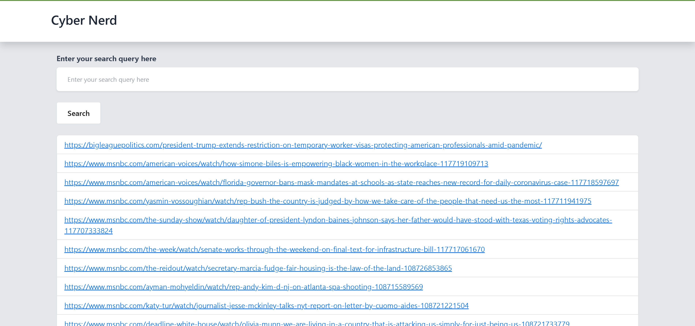

# Search-Engine-Master[Cyber Nerd]

## Table of Contents

- [Introduction](#introduction)
- [Details](#Details)
- [Setting up the project](#Setting-up-the-project)
- [Stats](#stats)
- [Screen Shots](#screens-shots)

## Introduction

This is a search engine that uses the TF-IDF algorithm to rank the results. It uses various techniques to dynamically add data to the index and to improve the search results. It has instantaneously fast search results for both one word and multi-word searches.
There is also a web interface that allows you to search for a query and view the results.

## Details

### Indexing

The index is stored in a JSON file. The index is a dictionary where the keys are the words and the values are the documents that contain the word. The documents are stored as a dictionary where the keys are the document IDs and the values are the TF-IDF score of the word in the document.

### Ranking

The ranking is done using the TF-IDF algorithm. The TF-IDF score of a word in a document is calculated as follows:

`TF-IDF = TF * IDF`

`TF = (Number of times the word appears in the document) / (Total number of words in the document)`

`IDF = log(Total number of documents / Number of documents containing the word)`

### Web Interface

The web interface is a Flask application that allows you to search for a query and view the results. The results are ranked using the TF-IDF algorithm. The top Ten search results are displayed. The results are displayed in as urls. The results are presorted, so only the search is required to be done dynamically.

### Dynamic Indexing

The index is dynamically updated when a new document is added without deletion of the old index. The new document is added to the index and the TF-IDF scores of the words in the old documents are updated. The TF-IDF scores of the words in the new document are calculated and added to the index.

## Setting up the project

### Requirements

- Python 3.6 or higher
- Multi-core CPU
- Enough RAM to store the index
- Enough disk space to store the index
- Enough disk space to store the documents

### Installation

- Clone the repository
- Download the documents from [here](https://dataverse.harvard.edu/api/access/datafile/6078140)
- Extract the documents to a folder
- Install the requirements (pip install -r requirements.txt)
- In terminal run the following commands:
    - >python
    - >import nltk
    - >nltk.download()
    - Download the complete library from the GUI
    - >exit()
- In application_inverted_index.py change the path of the documents folder to the path of the folder where the documents are stored
### Running
- Run the application_inverted_index.py file
- Run the app.py
- Open the web browser and go to http://127.0.0.1:5000/
- Click Launch Server
- Input Absolute path to the folder containing the json you want to dynamically add.
- Click Add Content
- Click Search
- Input the query and click Search
- The top Ten results are displayed

## Stats

- The Dataset contains 1.6 Million articles
- 200,000 articles have been tested on this code.
- The python script took less than 3 minutes to parse, create the forward index, lexicon, inverted index, and rank the documents on an 8 core machine.
- Search Speed is instant, both the single word and multi-word(even whole paragraphs)
- Ranking can be improved based on as TP-IDF doesn't take Proximity or Position into consideration.

## Screens Shots
### Web Interface

### Search Results

